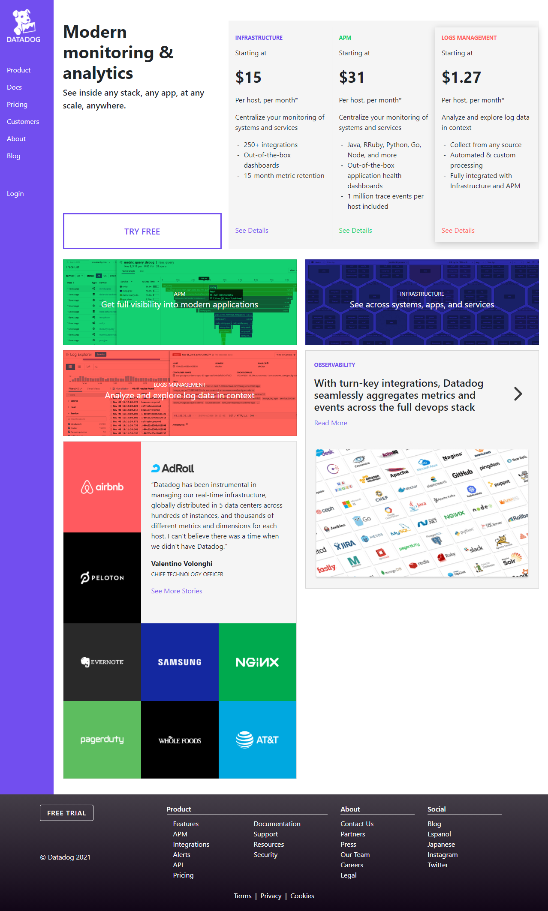

# Datadog Test Site

Site deployed at [AWS](http://datadog-test-site.s3-website-us-east-1.amazonaws.com/) and [Amplify](https://main.dsil1b5ijwqvu.amplifyapp.com/)

This site uses Hugo, Bootstrap 4, and Sass. This is my first attempt using Hugo (a static site generator), which was difficult, but interesting. More work on templating needed - I built and used a custom template. This is a 1 page site (index landing page) with all links set up, but currently resolving to home.

JS: Not really needed for this page. Some really basic coding for the navbar for mobile - simple implementation that shows a fullscreen nav with links and hides the rest (togglable). Other source of JS would be the carousel on one of the cards, but this is easily implemented with BS. Any more interactivity is done with just CSS (hovers, background changes, shadows, etc). I think a page like this doesn't need to be doing a lot of extra, possibly distracting, things.

Possible additions:

  - On mobile, could collapse the price comparison section into an accordion. That might look nice.
  - On desktop / mobile, could have the navigation buttons (desktop) or navbar itself (mobile) follow the user on scroll.
  - On desktop, customer square boxes could do more on hover (stylistic choice)
  
Future work: Need to learn more on Hugo content and templating.

To deploy and develop on a host machine, install hugo. Clone repo down. Use `$ hugo server -D`.

Resources:

  -  [Youtube Video on SASS Pipeline in Hugo](https://www.youtube.com/watch?v=NKLwuZIkReg&ab_channel=Jantcu)
  -  [Youtuber Mike Dane has video turturials on Hugo](https://www.youtube.com/watch?v=qtIqKaDlqXo&t=5s&ab_channel=MikeDane)

